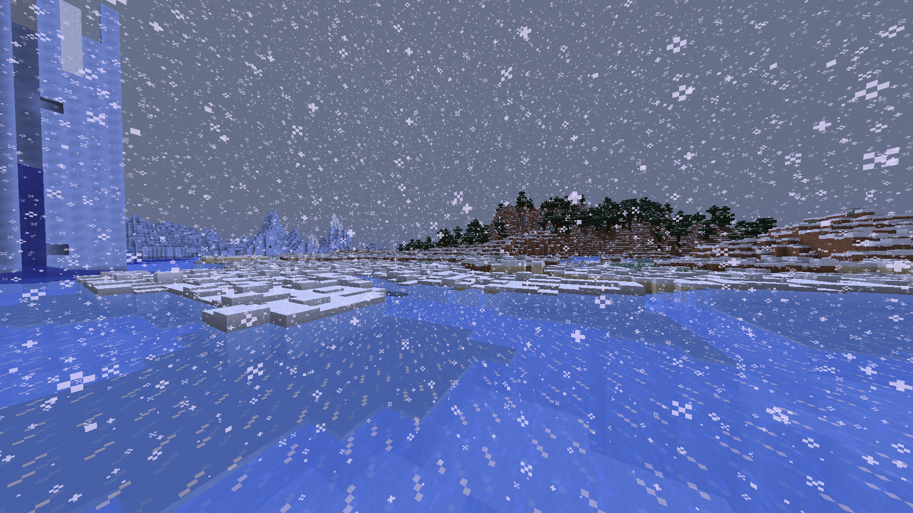
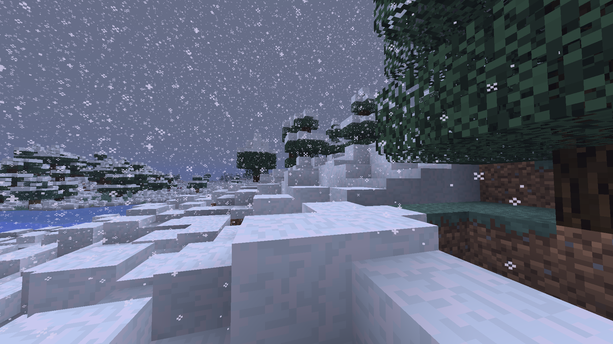

## Endless Snow
  - A Minecraft plugin to allow endless snow pile-up and persistent storms
    - Supporting datapack adds a winter world preset, including only snow biomes
  - Supports Spigot 1.21.10
  - Don't use this on worlds you care about
    - I'd recommend creating a fresh winter world, then backup regularly
  - This won't work on any 8 layer deep snow 'blocks' created while deep snow is disabled

## Datapack:
  - Optionally, the winter world datapack can be used
    - It adds `winter-base` and `winter-full` world presets that only include snowy biomes
  - The plugin works without the datapack, this is only for optional world generation
  - It must be installed _before_ world generation, and used as the world preset
    - For servers, set `level-type` to `winter-base` or `winter-full` in `server.properties`
  - `winter-base` sets the entire world to a frozen river
  - `winter-full` includes all snowy biomes, but is more likely to have versioning issues

### Building:
  - Requires `python3` and `zip`
  - Use `./datapack.sh` to build the datapack to `target/`
    - By default, this will only build `winter-base`
    - Use `./datapack full` to download biome data and include `winter-full`
      - This also requires `wget`

## Installation:
  - Use `mvn package` to compile the plugin to `target/`
    - Alternatively, download a release
  - See [Building](#building) to build the datapack
    - Alternatively, download a release (`frozenBiomes.zip`)
  - Copy the plugin and (optionally) the datapack to your server
    - If the datapack is used, set `level-type` to `winter-base` or `winter-full` in `server.properties`
    - This will only take effect when a new world is generated, with the datapack

## Usage:
### Deep snow:
  - Use `/deepsnow` to check deep snow status
  - Use `/deepsnow on` to enable deep snow
  - Use `/deepsnow off` to disable deep snow

### Persistent storm:
  - Use `/persistentstorm` to check the persistent storm's status
  - Use `/persistentstorm on` to enable the persistent storm
  - Use `/persistentstorm off` to disable the persistent storm

## Config:
  - `deepSnow`: `[true / false]` - Enable deep snow when the server starts
  - `persistentStorm`: `[true / false]` - Start a persistent storm when the server starts
  - `allowLeafAccumulation`: `[true / false]` - Allow deep snow accumulation on leaves

## Screenshots:

